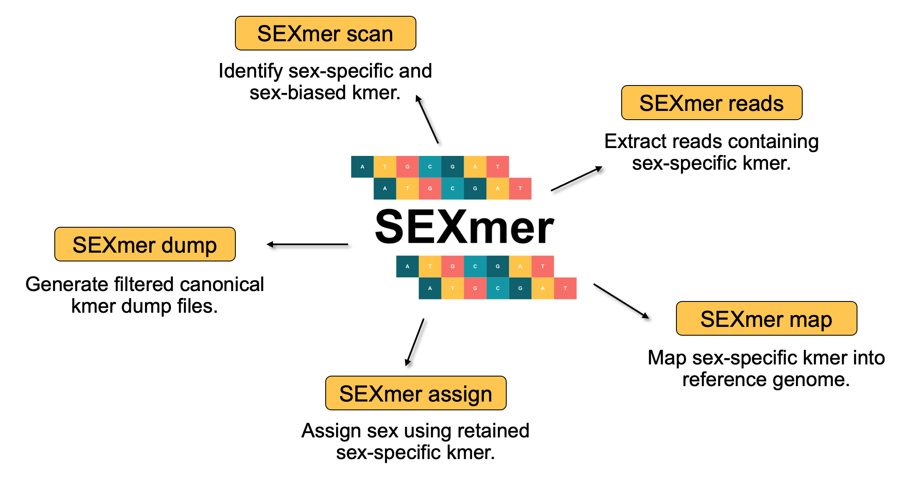
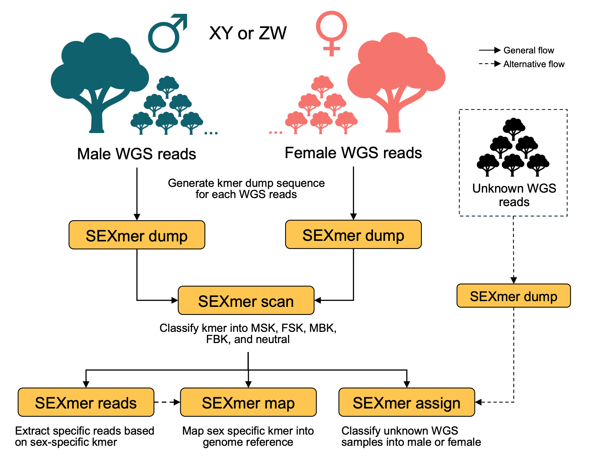
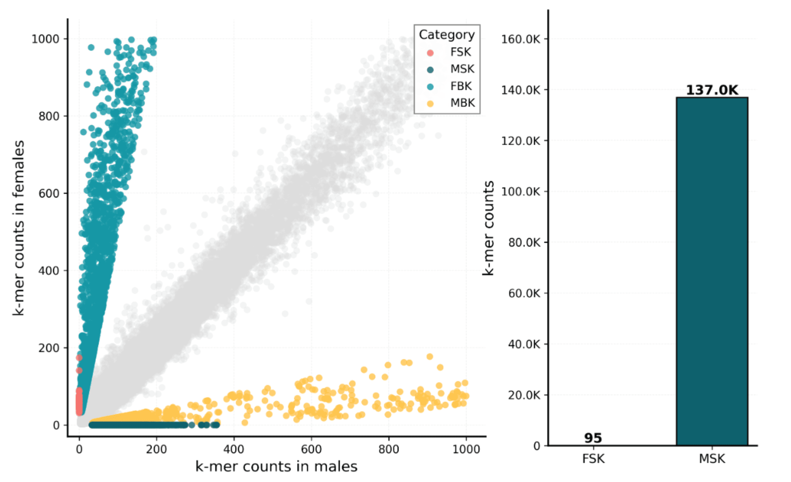
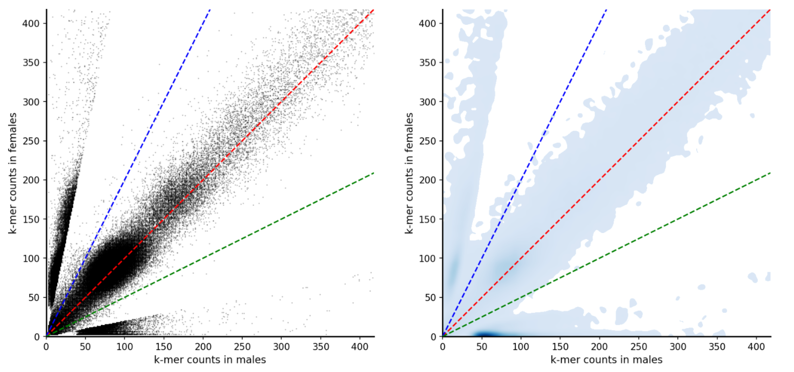
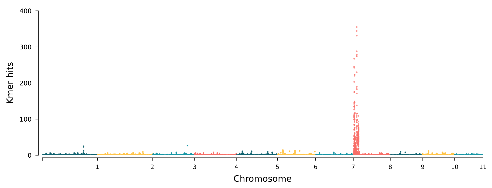
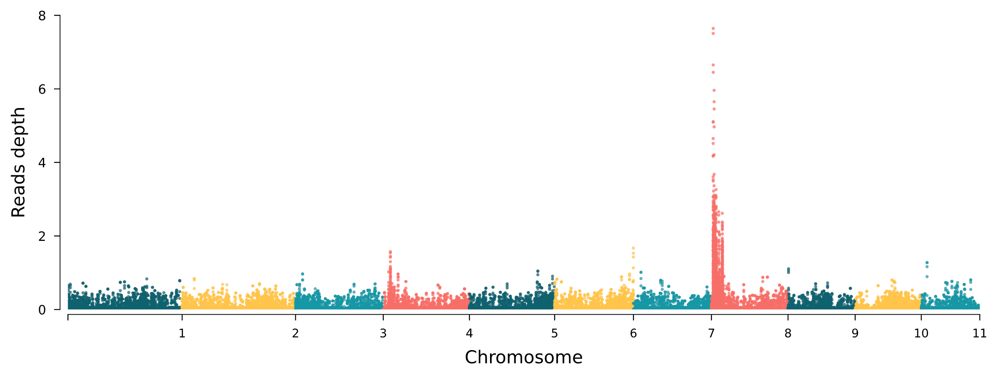

# SEXmer: Fast and resource efficient sex determination analysis using kmer


Identifying the sex determination region (SDR) in some plants or animals requires huge effort, especially for XY and ZW sex types. To detect SDR robustly, we generally need population samples for both male and female individuals. This study often produces large whole-genome sequencing (WGS) data. K-mer-based method is a powerful strategy for detecting the sex determination region. However, processing population-scale kmer data requires huge computational resources.

Here we present SEXmer, a fast and resource-efficient command-line tool for sex determination region analysis based on kmer.  **"SEXmer provides a modular workflow from raw reads to sex-specific k-mer discovery, kmer based reads extraction, unknown sex classifier, and genomic localization of candidate SDR signals."**

Currently, SEXmer contain 5 modules:


## Important!
- A detail algorithm for each SEXmer module can be read [here](docs/detail_algorithm.md).
- SEXmer is already available in [DCS Cloud](www.dcs.cloud).

## Table of Contents
- [SEXmer: Fast and resource efficient sex determination analysis using kmer](#sexmer-fast-and-resource-efficient-sex-determination-analysis-using-kmer)
  - [Important!](#important)
  - [Table of Contents](#table-of-contents)
  - [Getting Started](#getting-started)
  - [Quick Usage Guide](#quick-usage-guide)
    - [SEXmer dump](#sexmer-dump)
    - [SEXmer scan](#sexmer-scan)
    - [SEXmer reads](#sexmer-reads)
    - [SEXmer map](#sexmer-map)
    - [SEXmer assign](#sexmer-assign)
  - [Frequently asked questions (FAQs)](#frequently-asked-questions-faqs)
  - [Limitation](#limitation)
  - [Citation](#citation)
  - [Contact information](#contact-information)


## Getting Started
SEXmer command line tool currently only available for Linux (tested on Ubuntu and CentOS). SEXmer is implemented as a bash script, embedded with Python, and using some external dependencies.

**Dependencies**
- [Python3](https://www.python.org/) (>3.8, tested on 3.10)
- Python library: 
  - [numpy](https://numpy.org/) >=1.26 
  - [pandas](https://pandas.pydata.org/) >=2.2
  - [matplotlib](https://matplotlib.org/) >=3.8
  - [scipy](https://scipy.org/) >=1.11
- [KMC](https://github.com/refresh-bio/KMC) (tested on 3.2.4)
- [BBMAP](https://bbmap.org/) (tested on 39.81)

All of these dependencies can easily be installed using conda.
```bash
#create the environment with it depedencies
conda create -n sexmer -c conda-forge -c bioconda python=3.10 kmc bbmap numpy pandas matplotlib scipy

#activate the environment
conda activate sexmer
```

**Instalation**

Currently, SEXmer only supports manual installation. Clone the repository or download a specific released package.
```bash
git clone https://github.com/dedee95/SEXmer.git
cd SEXmer
chmod -R 755 bin/
export PATH="$PWD/bin:$PATH"
```

## Quick Usage Guide
After all dependencies are installed, type `SEXmer -h` to verify installation.
```
SEXmer: A resource-efficient toolkit for sex determination region analysis using k-mers.

Usage: SEXmer <module> [options]

Modules:
dump      Generate filtered canonical k-mer dump files.
scan      Identify sex-specific and sex-biased k-mers.
reads     Extract reads containing sex-specific k-mers.
map       Map sex-specific k-mers or sex-specific reads.
assign    Assign sex using validated sex-specific markers.

Use SEXmer <module> -h for detailed each module usage.
```

Here is a typical SEXmer workflow for XY and ZW sex type. The main difference when working with XY and ZW is the `sexmer scan` result. In XY, we mainly use MSK for further analysis, but in ZW, we mainly use FSK for further analysis.



### SEXmer dump
Generate and filter a kmer dump sequence from raw WGS reads. This core module backbone is disk-based computational, and it runs very fast to generate canonical kmer. By default, output from the `SEXmer dump` is in `.gz` format to reduce the file size.

The input data can be either WGS short paired reads or long reads. If you have multiple samples, you need to run this module one by one. It's truly recommended to use `--prefix` according to your sample name to avoid mixing male and female samples.

```
SEXmer dump - Generate and filter a k-mer dump sequence from raw WGS reads.

Usage: SEXmer dump --prefix <sample> <reads_1.fq.gz> [reads_2.fq.gz] [OPTIONS]

Mandatory:
  --prefix             The prefix used on generated files
  <reads>              Raw WGS short reads or long reads (.gz is accepted)

Optional:
  -k, --kmer-size      Specify k-mer size (1-63)                      [default: ${KMER_SIZE}]
  --min-count          Minimum k-mer count (KMC -ci)                  [default: ${MIN_COUNT}]
  --trigger-seq        Specify a trigger sequence (i.e. AG)           [default: off]
  -t, --threads        Specify CPU threads for this task              [default: ${THREADS}]
  -o, --outdir         Specify output directory name                  [default: current dir]
  --tmpdir             Specify parent directory for the temp files    [default: current dir]
  --kmc-bin            Specify path containing KMC binaries           [default: PATH]
  -h, --help           Show this help message and exit
```

Output files should be as follows:
```
<prefix>.dump.gz  | The kmer dump sequence in compressed form.
```

### SEXmer scan
Scan all kmer sequences from the pooled male and female sample output from `SEXmer dump` and classify them as male specific kmer (MSK), female specific kmer (FSK), male bias kmer (MBK), female bias kmer (FBK), and neutral. The core biological algorithm in this module is inspired by [Akagi et al. (2014)](https://www.science.org/doi/10.1126/science.1257225) from their Science paper. `SEXmer scan` uses disk-based and streaming algorithms to reduce RAM consumption (even 8 GB RAM is enough to run this module). 

It's recommended to use at least 8 samples from both sexes for a better result. If sequencing depth is sufficient, 8 to 10 samples will produce a good result. Using more than 10 samples from both sexes is not always necessary. Make sure you do **NOT** mix male and female samples.

```
SEXmer scan - Scan all k-mer sequences and classify them as MSK, FSK, MBK, FBK, or neutral.

Usage: SEXmer scan -m <male_files> -f <female_files> [OPTIONS]

Mandatory:
  -m, --male           Specify male dump files (separated by commas)
  -f, --female         Specify female dump files (separated by commas)

Optional:
  --prefix             The prefix used on generated files              [default: output]
  -o, --outdir         Specify output directory name                   [default: current dir]
  --mem                Specify max MEM for this task (e.g. 8G)         [default: ${MEM}]
  -t, --threads        Specify CPU threads for this task               [default: ${THREADS}]
  --neutral-max        Maximum neutral k-mers to retain, 0=keep all    [default: ${NEUTRAL_MAX}]
  --tmpdir             Parent directory for the temporary work folder  [default: current dir]
  --min-count          Minimum k-mer count to retain                   [default: ${MIN_COUNT}]
  --max-count          Maximum pooled k-mer count within one sex       [default: ${MAX_COUNT}]
  --fold-threshold     Specify fold-change cutoff for MBK/FBK          [default: ${FOLD_THRESHOLD}]
  --seed               Specify random seed for neutral k-mer sampling  [default: ${SEED}]
  --no-plot            Do not generate any visualization
  --plot-format        Specify plot format: svg, png, or pdf           [default: ${PLOT_FORMAT}]
  -h, --help           Show this help message and exit

Categories:
  MSK      Male-specific k-mer
  FSK      Female-specific k-mer
  MBK      Male-biased k-mer
  FBK      Female-biased k-mer
  neutral  K-mer without sex-specific or sex-biased signal
```

Output files should be as follows:
```
<prefix>.kmers.tsv        | Classified MSK, FSK, MBK, FBK, and neutral kmer in a .tsv file.
<prefix>.MSK.fa           | MSK sequence in FASTA file, extracted from the .tsv file.
<prefix>.FSK.fa           | FSK sequence in FASTA file, extracted from the .tsv file.
<prefix>.sexplot.png      | Scatter plot for MSK, FSK, MBK, FBK, and neutral in left panel; Bar plot for FSK and MSK in right panel.
<prefix>.abundance.png    | Abundance plot for MSK, FSK, MBK, FBK, and neutral. This is useful to see the abundance position of MSK or FSK.
```
An example of `<prefix>.sexplot.png`:



An example of `<prefix>.abundance.png`:



### SEXmer reads
Extract specific reads based on kmer sequence (MSK or FSK), output from `SEXmer scan`. Make sure the kmer sequence used in this module is generated from the `SEXmer scan`.

Input reads can be WGS paired short reads or long reads ([ONT](https://nanoporetech.com/), [Cyclone](https://en.cyclone-seq.com/), or [PacBio](https://www.pacb.com/)). For long reads, it's recommended to set `--hit` to more than 1 to get truly specific reads (3 is fine for long reads). If long noisy reads are used, it's recommended to polish the reads first; if not, it's also fine.

```
SEXmer reads - Extract specific reads based on k-mer sequence (MSK or FSK).

Usage: SEXmer reads <markers.fa> -r <reads> --prefix <prefix> [OPTIONS]

Mandatory:
  <markers.fa>         Sex specific kmer sequence, e.g. MSK.fa (.gz accepted)
  -r, --reads          Raw WGS short reads or long reads (separated by commas)
                       Example: -r reads_1.fq.gz,reads_2.fq.gz or 
                                -r long_reads.fq.gz
  --prefix             The prefix used on generated files

Optional:
  --hit                Specify minimum k-mer hits per reads            [default: ${MIN_HIT}]
  -k, --kmer-size      Specify k-mer sized based on sex specific kmer  [default: ${KMER_SIZE}]
  -t, --threads        Specify CPU threads for this task               [default: ${THREADS}]
  -o, --outdir         Specify output directory name                   [default: current dir]
  --tmpdir             Specify parent directory for the temp files     [default: current dir]
  --bbduk-bin          Specify path containing bbduk.sh                [default: PATH]
  -h, --help           Show this help message and exit
```

Output files should be as follows:
```
# If WGS short paired end are given
<prefix>.sexmer_1.fq.gz   | Extracted WGS short reads based on the given kmer sequence (forward strand).
<prefix>.sexmer_2.fq.gz   | Extracted WGS short reads based on the given kmer sequence (reverse strand).

# If WGS long reads is given
<prefix>.sexmer.fq.gz     | Extracted WGS long reads based on the given kmer sequence.
```

### SEXmer map
Map sex-specific kmer sequence into the genome reference and generate kmer hits along the window and step size. The main purpose of this module is to perform kmer enrichment across a reference genome, then identify it as SDR. This module also facilitates mapping the extracted reads into the genome and generating depth information. Moreover, this module generates a [Manhattan plot](https://en.wikipedia.org/wiki/Manhattan_plot) to see the SDR signal location.

If the sex type is XY, it is recommended to use the MSK sequence for mapping into the genome reference. For ZW sex type, use the FSK sequence. Extracted sex specific WGS short reads and long reads can be used as well. Based on our experience, extracted sex specific reads with very low depth are enough to just locate the SDR signal. If you want to use huge reads data for mapping, please use a common mapping tool such as [BWA-MEM2](https://github.com/bwa-mem2/bwa-mem2) or [minimap2](https://github.com/lh3/minimap2) instead.

```
SEXmer map - Map specific k-mer sequence or reads into the genome reference.

Usage: SEXmer map <genome.fa> <markers.fa> --prefix <prefix> [OPTIONS]

Mandatory:
  <genome.fa>          Specify reference genome in FASTA file (.gz is accepted)
  <markers.fa>         Specify sex specific k-mer sequence, e.g. MSK.fa (.gz is accepted)
  --prefix             The prefix used on generated files

Optional:
  -k, --kmer-size      Specify k-mer size (1-63)                       [default: ${KMER_SIZE}]
  -w, --window         Specify window size in bp                       [default: ${WINDOW}]
  -s, --step           Specify sliding step size in bp                 [default: ${STEP}]
  -r, --reads          Input extracted raw reads from SEXmer reads (comma-separated)
                       Examples: -r reads.fq.gz OR -r reads_1.fq.gz,reads_2.fq.gz
  --seq-type           Specify reads type: short or long               [default: ${SEQ_TYPE}]
  -t, --threads        Specify CPU threads for this task               [default: ${THREADS}]
  -o, --outdir         Specify output directory name                   [default: current dir]
  --tmpdir             Specify parent directory for the temp files     [default: current dir]
  -h, --help           Show this help message and exit
```

Output files should be as follows:
```
<prefix>.kmer.manhattan.svg   | Manhattan style plot. Y axes represent kmer hits and X axes represent chromosome region.
<prefix>.kmer.windows.tsv     | A .tsv file that contain several information, including chr, start, end, hits, and hits_per_10kb.
```

Output files if `-r` or `--reads` are specified:
```
<prefix>.reads.manhattan.svg  | Manhattan style plot. Y axes represent reads depth and X axes represent chromosome region.
<prefix>.reads.windows.tsv    | A .tsv file that contain several information, chr, start, end, and depth.
```

An example of `<prefix>.kmer.manhattan.svg`:



An example of `<prefix>.reads.manhattan.svg`:



### SEXmer assign
Assign sex from unknown samples using sex-specific kmer (MSK or FSK) from `SEXmer scan`. This module uses sex-specific kmer present ratio to classify an unknown sample into male or female. The quality of the assignment **HEAVILY DEPENDS** on the quality and transferability of the sex-specific kmer. In the future, we will implement our self-developed algorithm,  "*SEXmer iterative classifier (SIC)*", for a more robust classification. 

For XY sex type, use MSK as a sex-specific kmer marker and use FSK if the sex type is ZW. Input all of the unknown reads sample at once. If the original MSK or FSK set is weak or noisy, assignment performance may be poor. Only trust the result when it shows "**high confidence**".

```
SEXmer assign - Assign sex from unknown samples using sex-specific k-mer (MSK or FSK).

Usage: SEXmer assign <markers.fa> -i <dump_files> --type <XY|ZW> [OPTIONS]

Mandatory:
  <markers.fa>          Sex specific k-mer sequence, e.g. MSK.fa(.gz accepted)
                        For XY systems, provide MSK.
                        For ZW systems, provide FSK.
  -i, --input           K-mer dump file from unknown sample, separated by commas (.dump or .dump.gz)
  --type                Specify sex chromosome system: XY or ZW

Optional:
  -s, --sample          Specify each sample names, separated by commas. 
                        [default: derived from dump filename by removing .dump.gz/.dump]
  -k, --kmer-size       Specify k-mer size used for marker parsing     [default: ${KMER_SIZE}]
  -t, --threads         Specify CPU threads for this task              [default: ${THREADS}]
  -o, --outdir          Specify output directory name                  [default: current dir]
  --tmpdir              Specify parent directory for the temp files    [default: current dir]
  -h, --help            Show this help message and exit
```

Output files should be as follows:
```
<prefix>.assign.txt   | Summary information about sex assignment result. Some important information including, sex type, largest gap, separation, sex-specific kmer ratio, confident, etc.
```

## Frequently asked questions (FAQs)
- Do I need to run the entire SEXmer module?

  Generally, not every analysis needs the SEXmer module. In case you only want to get sex-specific kmer, either MSK or FSK, you can just use `SEXmer dump` and `SEXmer scan`. If the reference genome is available, you can use `SEXmer map` to detect the SDR signal in which chromosome. If you want to assemble the sex chromosomes, you will need to extract sex-specific reads based on MSK (for XY type) or FSK (for ZW type), then perform assembly. Moreover, if you have an unknown WGS sample and you want to know whether it is male or female, you can use `SEXmer assign`.

## Limitation
SEXmer is designed specifically for XY and ZW sex type with known male and female samples. Robutstness of sex-specific kmer (MSK or FSK) depends on sample quality, sample number, and sequencing depth. You truly need to have high confidence when labeling male and female samples for SEXmer. When you have a misclassified sample, SEXmer will perform poorly.


## Citation
SEXmer has no prior publication yet. If you use this tool in your research, please cite the repository for now.
> Kurniawan, D., Fang, W. & Tong, W. 2026. SEXmer: Fast and resource efficient sex determination analysis using kmer. https://github.com/dedee95/SEXmer

## Contact information
If you have any questions or suggestions regarding SEXmer, feel free to contact one of the contacts below.
- Linkedin: [https://www.linkedin.com/in/dede-kurniawann/](https://www.linkedin.com/in/dede-kurniawann/)
- E-mail: [dedekurniawan@genomics.cn](mailto:dedekurniawan@genomics.cn)
