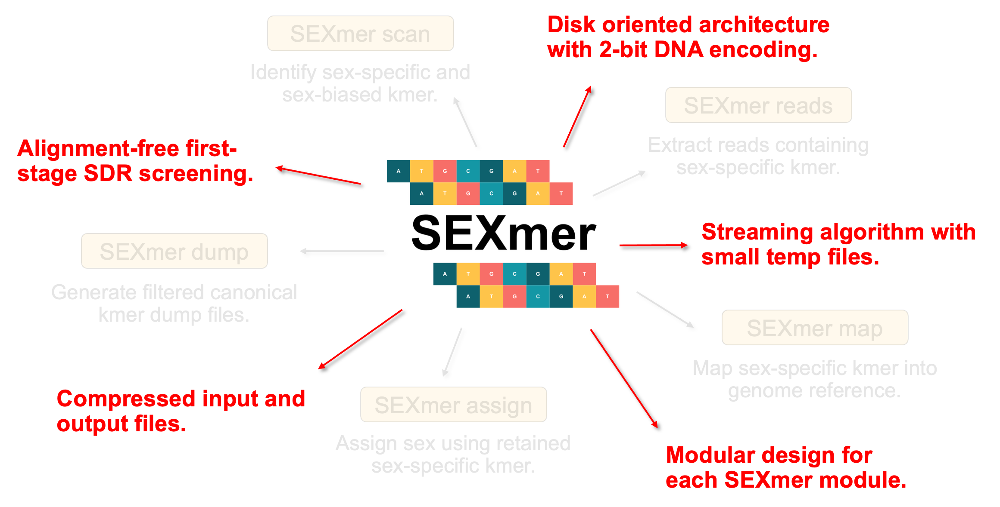
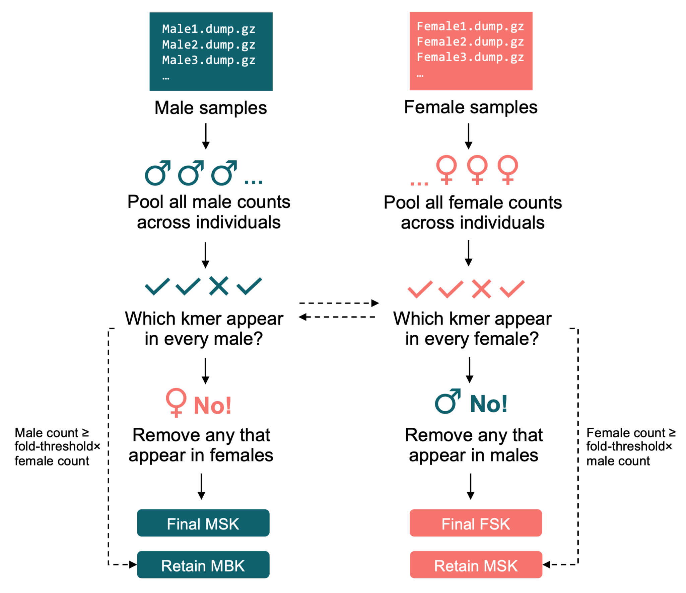
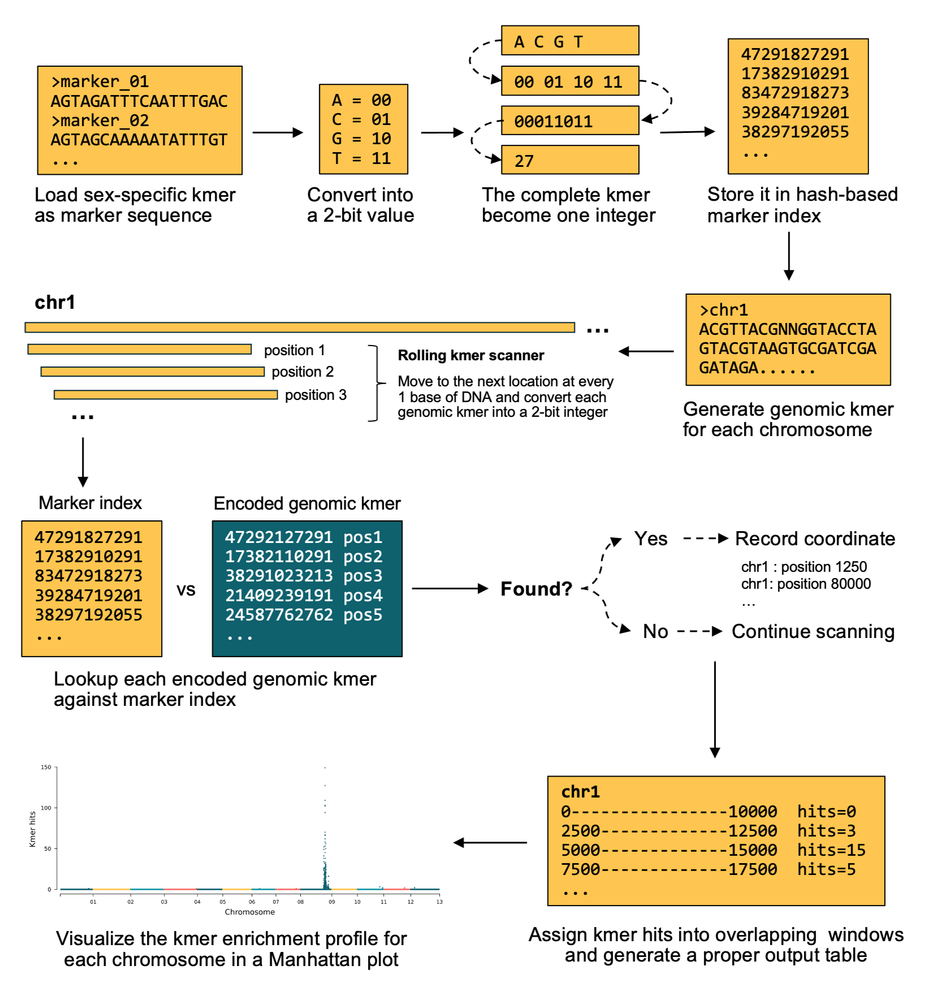
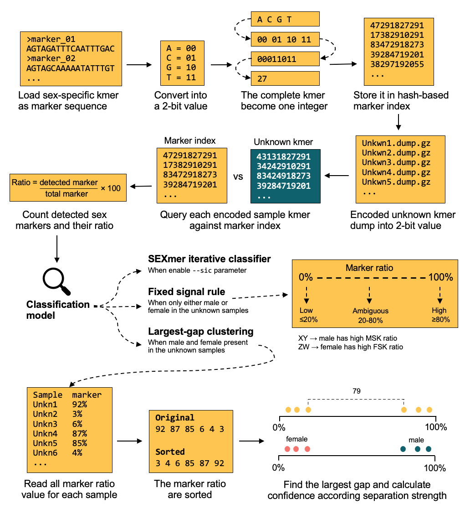

# SEXmer Detail Algorithm
SEXmer was initially inspired by [KMC](https://github.com/refresh-bio/KMC) for its disk-oriented architecture and [quarTeT](https://github.com/aaranyue/quarTeT) for its dispatcher design. This tool was developed as a memory-efficient, disk-based, and [streaming computational framework](https://en.wikipedia.org/wiki/Streaming_algorithm) to minimize RAM consumption when processing large-scale kmer. Several components of SEXmer utilize [2-bit DNA sequence encoding](https://medium.com/analytics-vidhya/bioinformatics-2-bit-encoding-for-dna-sequences-9b93636e90e2) to accelerate operations and reduce memory consumption. SEXmer did not rely on WGS read alignment, as in the GWAS/SNP method, resulting in greater resource efficiency. Moreover, SEXmer adopts a modular architecture in which each module can run independenly. Therefore, users can execute only the required function without installing all dependencies. Here are the details of the computational algorithm and implementation of each SEXmer module.



## SEXmer dump
This module basically is very simple; it generates kmer frequency (dump) from each raw WGS read. The main backbone of this module is KMC. We chose KMC over other kmer-counting tools like [Jellyfish](https://github.com/gmarcais/Jellyfish) or [Meryl](https://github.com/marbl/meryl) because it uses a disk-oriented architecture for kmer counting. In short, KMC uses less RAM, and it operates very fast. 

To reduce the output data, we implemented a minimum kmer count and a trigger sequence. A low-frequency kmer with a count less than 3 is most likely an artifact or sequencing error, so it is better to remove it. Therefore, this minimum count treshold is applied to reduce noise. On the other hand, the trigger sequence makes the `SEXmer dump` keep only kmers that start with the nucleotide specified in the trigger sequence. For example, if we specify the trigger sequence as "AG", only kmers starting with "AG" will be kept. This can significantly reduce the kmer output (1/16) while still preserving important information.

## SEXmer scan
`SEXmer scan` identifies and classifies kmers as sex-associated based on their presence across known male and female samples. In short, this module asks: 

> Given a set of known male and female samples, which kmers are male-specific, female-specific, male-biased, female-biased, and neutral?

This module takes input kmer dump sequences generated from known male and female WGS samples using `SEXmer dump`. `SEXmer scan` compares male and female kmer profiles and classifies each retained kmer into one of five categories:

| Category | Meaning |
|----------|---------|
| MSK     | Male-specific kmer. Present in every male, and completely absent from all females. |
| FSK     | Female-specific kmer. Present in every female, and completely absent from all males. |
| MBK     | Male-biased kmer. Present in every male, and the male pooled count is at least `fold-threshold` times higher than the female count. |
FBK     | Female-biased kmer. Present in every female, and the female pooled count is at least `fold-threshold` times higher than the male count.   |
neutral | Present in union of both sexes |



`SEXmer scan` fully uses disk-based operation built around GNU sort, join, and awk. This design allows SEXmer to process large kmer data without loading all kmer into memory at once. Technically, 8 GB of RAM is enough to run this process even if your kmer dump file is very large.

```
1. Read all male and female kmer dump files from the SEXmer dump.
2. Sort each input file by kmer sequence and aggregate pooled kmer counts separately for males and females.
3. Build a male consistency index containing kmers present in all male samples.
4. Build a female consistency index containing kmers present in all female samples.
5. Identify male-specific kmer candidates from male-consistent kmers.
6. Identify female-specific kmer candidates from female-consistent kmers.
7. Apply cross-sex exclusion to obtain true MSK and FSK.
8. Build a full make/female union count table.
9. Identify male-biased and female-biased kmers using fold-change filtering.
10. Identify neutral kmers without strong sex-specific or sex-biased signal.
```

## SEXmer reads
`SEXmer reads` use bbduk.sh from the [BBMAP](https://bbmap.org/) package to extract reads using kmer. We chose to implement bbduk over other tools because bbduk runs very fast and uses less RAM. Not just for WGS short paired reads, bbduk can also be used to extract specific reads from long-read sequencing. 

This module works by matching the given kmer sequence to reads. If a read hits the given kmer, bbduk will keep it. For WGS paired-end, bbduk writes both mates if either mate has at least the minimum marker hits. The minimum hits for WGS short reads is 1, while short read sequencing should have a minimum hits >1. Based on our experience, at least 3 hits should be sufficient for long-read extraction.

## SEXmer map
The core function of this module is to identify genomic regions enriched with a specific kmer. In simple terms, the `SEXmer map` asks:

>Where are sex-specific kmer sequences located and enriched in the genome?

SEXmer takes a sex-specific kmer sequence (MSK or FSK) and identifies its enrichment in the genome using a rapid kmer-based genome-scanning approach. This approach is much faster than traditional alignment like BWA-MEM2 because it does not align reads to the genome. Instead, `SEXmer map` scans the reference genome and checks whether each genomic kmer exists in the sex-specific marker set.



`SEXmer map` core algorithm use 2-bit integer encoding and rolling kmer scanning.

```
1. Convert a sex-specific kmer sequence into a 2-bit encoded integer and store it in a hash-based marker index. 
2. Generate the reverse complement of each marker, encode it as a 2-bit integer, and store it in a hash.
3. Scan the reference genome sequentially using a rolling 2-bit integer scanner. 
4. Generate each genomic kmer at the current position using efficient 2-bit operations (bit shifting, masking, and integer encoding). 
5. At each genomic position, update the current kmer using bit shifting and masking.
6. Skip kmers that contain non ATGC bases and query each valid genomic kmer against the marker index using hash lookup. 
7. If a marker match is detected, record the chromosome and genomic coordinate of the kmer hit. 
8. Assign each detected kmer hit to overlapping sliding windows based on its genomic coordinate. 
9. Count the number of marker hits within each window and normalize the hit density based on the number of valid genomic kmer sites. 
10. Generate a genome-wide kmer enrichment profile for for identifying candidate sex-determining regions.
```

The `SEXmer map` also provides an optional sex-specific read validation mode. This feature facilitates more evidence of sex determination. This feature asks

>Do actual sequencing reads support the genomic location identified by sex-specific kmers?

The main computational engine for this step is BBMAP, which can map both short-read and long-read sequencing data. For short-read data, `SEXmer map` uses `bbmap.sh`. For long-read data, it first splits long reads into smaller pieces and then uses mapPacBio.sh when available, or falls back to `bbmap.sh`. But bbmap has a limit for mapping large genomes, so `SEXmer map` splits the large genome into several chunks. Also, bbmap splits the long reads into 6000 bp pieces. 

>*However, read validation in `SEXmer map` is intended as a quick supporting analysis rather than a full replacement for dedicated read-alignment workflows.*


## SEXmer assign
`SEXmer assign` classify unknown WGS reads into male or female based on the sex-specific present ratio. WGS reads should be converted into kmer dump file using `SEXmer dump` first.

- XY system
  - Male-specific kmers (MSK) are used as markers
  - High marker signal indicates male
  - Low marker signal indicates female
- ZW system
  - Female-specific kmers (FSK) are used as markers
  - High marker signal indicates female
  - Low marker signal indicates male

The `SEXmer assign` contains 2 classifiers: 
1. Standard classifier 
2. SEXmer iterative classifier (SIC)

### Standard classifier
This classifier assigns unknown WGS samples based on the provided sex-specific kmer and the present ratio.



```
1. Provide robust sex-specific kmer marker output from SEXmer scan.
2. Each kmer sequence will be converted into a 2-bit encoded integer and stored in a hash-based marker index.
3. Each unknown sample kmer dump file will be encoded using the same 2-bit conversion.
4. Query each encoded kmer in the unknown sample against the marker index using hash lookup.
5. Calculate marker ratio for each unknown sample (detected sex marker / total sex marker * 100)
6. The standard classifier uses larger gap clustering to separate high-marker and low-marker groups based on the marker ratio value.
7. When the unknown sample set does not show clear separation, SEXmer applies predefined biological thresholds.
    - low signal group <= 20%
    - high signal group >= 80%
    - ambiguous 20% - 80%
```

Here are detail about largest gap clustering procedure
```
1. Collect marker ratios from all unknown samples.
2. Sort marker ratios in ascending order.
3. Calculate the difference between every two adjacent marker ratios.
4. Identify the largest separation gap.
5. Record the two values surrounding the largest gap.
6. Calculate the midpoint between these two values as the classification threshold.
7. Check whether the dataset contains both low-marker and high-marker signal groups.
8. Use largest-gap clustering only if: 
    - the largest gap is ≥ 20%, and  
    - at least one sample has low marker signal ≤ 20%, and 
    - at least one sample has high marker signal ≥ 80%.
9. Assign samples above the threshold as high-marker sex and samples below the threshold as low-marker sex.
10. Calculate confidence according to marker-ratio separation strength.
```

### SEXmer iterative classifier (SIC)
The main goal of this algorithm is to improve sex-specific kmer when the initial known female or male samples are limited. SIC uses the current sex-specific kmer to assign pseudolabels to unknown samples and iteratively improves the sex-specific marker set.

```
1. Take input from the initial known male and female samples with their sex-specific kmer.
2. Convert the initial sex-specific kmer into a 2-bit encoded integer and store it in a hash-based marker index.
3. Scan all unknown samples against the initial marker sex index.
4. Calculate marker ratios for every unknown sample.
5. Build a classification model using largest-gap clustering or the fixed signal rule.
6. Identify unknown samples with strong high-marker or low-marker signals.
7. Assign high-confidence pseudo-sex labels to selected unknown samples (select 1 sample each iteration).
8. Add pseudo-labeled samples into the corresponding reference group (known male & female).
9. Recalculate MSK/FSK markers using updated reference groups.
10. Repeat the the scan, classification, pseudo-labeling, and marker-recalculation process until:
    - Strong separation is achieved,
    - Target reference size is reached (at the least 8 male or 8 female in total),
    - No improvement occurs,
    - Maximum iteration number is reached (10).
11. Perform final sex assignment using the optimized marker set.
```

After all unknown samples are classified, we will have sufficient samples to generate robust sex-specific kmer (MSK/FSK). Then, we can choose 8 to 10 samples for both sexes for the final running of SEXmer assign.

> *Generally, if the sex-specific kmer marker is already robust, the standard classifier will be sufficient. A robust kmer marker can be achieved by using at least 8 male and female WGS samples with sufficient depth (>=10). Moreover, if the known sample isn't enough and is not balanced, i.e., 5 male + 10 female, you can use the `--sic` parameter to enable the SEXmer iterative classifier. However, this algorithm is still in early development; it is somewhat unstable and may not work well if the known sample size is too small.*

